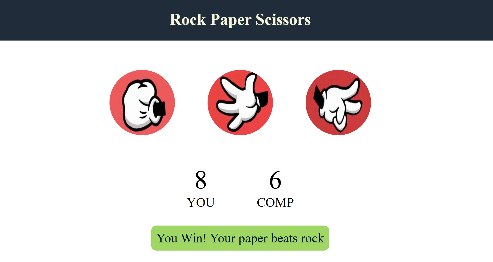

# ✊✋✌️ Rock Paper Scissors

A fun and interactive **Rock Paper Scissors** game built using **HTML, CSS, and JavaScript**. Challenge the computer, track your score, and enjoy an engaging user interface with dynamic game messages.

---

## 🚀 Live Demo

🔗 https://ujjaini-das.github.io/Rock-Paper-Scissors/

---

## 📂 GitHub Repository

🔗 https://github.com/ujjaini-das/Rock-Paper-Scissors

---

## ✨ Features

- 🎮 Play against the computer
- 🧠 Random computer choice generation
- 🏆 Win, Lose, and Draw detection
- 📊 Live score tracking
- 🎨 Dynamic message colors based on game result
- ⚡ Built using pure JavaScript (No libraries or frameworks)

---

## 🛠️ Technologies Used

- HTML5
- CSS3
- JavaScript (ES6)

---

## 📸 Screenshot

---

## 📚 What I Learned

- DOM Manipulation
- Event Handling
- JavaScript Functions
- Random Number Generation
- Conditional Statements
- Score Tracking
- CSS Styling
- Dynamic UI Updates

---

## 👨‍💻 Author

**Ujjaini Das**

GitHub: https://github.com/ujjaini-das

---
